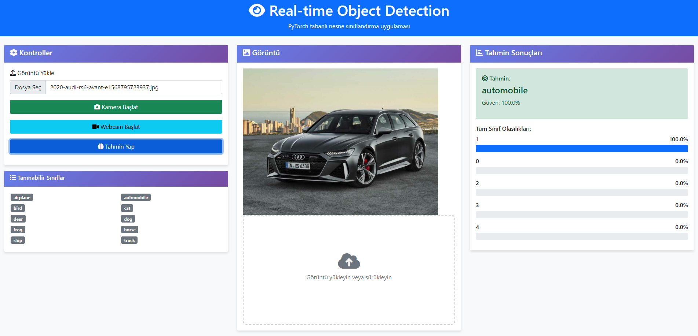
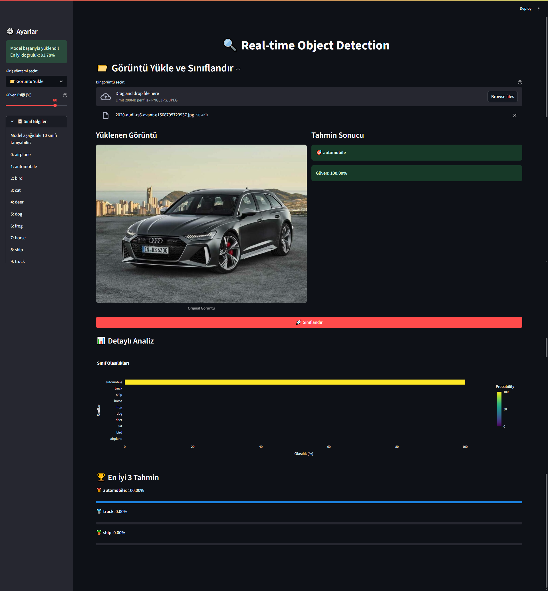
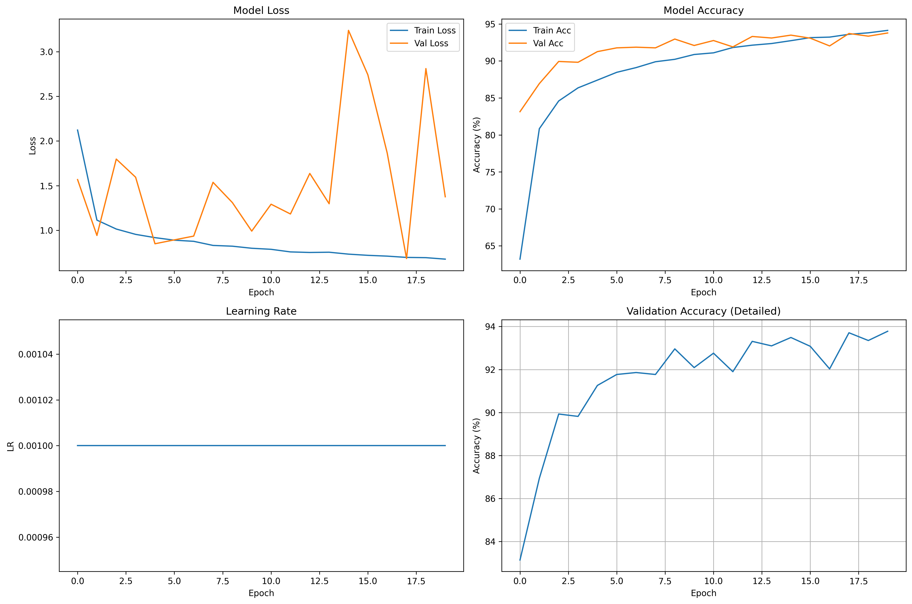

# 🧠 Real-Time Object Detection with Deep Learning

[](https://www.python.org/)
[](https://pytorch.org/)
[](https://flask.palletsprojects.com/)
[](https://streamlit.io/)

> 🎯 A complete end-to-end real-time object detection system using **transfer learning** and **deep CNNs**, deployed via Flask REST API and Streamlit web dashboard.

---

## 🚀 Overview

This project demonstrates a real-time object detection pipeline built with **PyTorch**, utilizing **ResNet50** and **EfficientNetB0** backbones fine-tuned on **CIFAR-10**. Live webcam feed is integrated for streaming predictions via a Flask API and an interactive Streamlit dashboard.

---

## 🎨 Key Features

- 🔁 **Transfer Learning** on ImageNet pre-trained CNNs  
- 🧪 **Custom Training** with advanced augmentations (Albumentations)  
- 📡 **Live Inference** via webcam (OpenCV + Flask API)  
- 🌐 **Interactive Web App** (Streamlit) for testing and visualization  
- 📊 **Detailed Class Probability Plots** for each prediction  
- 🧱 **Modular Architecture**: Training, Inference, and Deployment separated  

---

## 🎯 Model Performance

| Metric                 | ResNet50 |
|------------------------|----------|
| Test Accuracy          | 93.78%   |
| Validation Loss        | 0.60     |
| GPU Inference Time     | <100 ms  |
| CPU Inference Time     | <500 ms  |

---

## 🛠️ Tech Stack

| Layer      | Technologies Used                                      |
|------------|---------------------------------------------------------|
| Model      | PyTorch, ResNet50, EfficientNetB0                       |
| Data       | CIFAR-10, OpenCV, Albumentations                        |
| API        | Flask REST API, OpenCV live stream                      |
| Frontend   | Streamlit, HTML5, Bootstrap 5                           |
| Viz & Eval | Matplotlib, Seaborn, Plotly                             |

---

## 🖼️ Visuals
### Flask API 

### Streamlit Web App 

### Training History


---

## 📂 Project Structure

```bash
real-time-object-detection/
├── src/
│   ├── data_preparation.py         # Dataset loading and transforms
│   ├── model.py                    # Model architecture & loaders
│   ├── train.py                    # Training loop & metrics
│   └── utils.py                    # Helper functions
├── static/                         # Static assets for Flask frontend
├── templates/                      # HTML templates
├── models/                         # Saved model checkpoints
├── data/                           # Dataset or path configs
├── app.py                          # Flask API
├── streamlit_app.py                # Streamlit dashboard
├── config.py                       # Global config settings
├── requirements.txt
└── README.md
```
## 📝 License

This project was developed by İrfan Eren Cömert as part of his academic and personal portfolio.
⚠️ Unauthorized use, replication, or misrepresentation is strictly prohibited under the MIT License.
